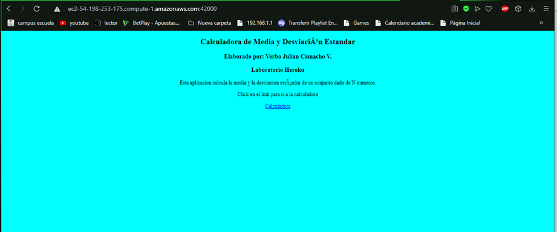

# Taller de Modularización con Virtualización e Introducción a Docker y a AWS
# Verbo Julian Camacho Villamarin

## Descripción
El taller consiste en crear una aplicación web pequeña usando el micro-framework de Spark java 
(http://sparkjava.com/). Una vez tengamos esta aplicación procederemos a construir un container 
para docker para la aplicación y los desplegaremos y configuraremos en nuestra máquina local. Luego,
cerremos un repositorio en DockerHub y subiremos la imagen al repositorio. Finalmente, crearemos una 
máquina virtual de en AWS, instalaremos Docker, y desplegaremos el contenedor que acabamos de crear.
## Prerrequisitos
Para la realización y ejecución tanto del programa como de las pruebas de este, se requieren ser instalados los siguientes programas:

  - Maven. Herramienta que se encarga de estandarizar la estructura física de los proyectos de software, maneja dependencias (librerías) automáticamente desde repositorios y           administra el flujo de vida de construcción de un software.
  - GIT. Sistema de control de versiones que almacena cambios sobre un archivo o un conjunto de archivos, permite recuperar versiones previas de esos archivos y permite otras         cosas como el manejo de ramas (branches).
  - Docker. Programa encargado de crear contenedores ligeros y portables para las aplicaciones software que puedan ejecutarse en cualquier máquina con Docker instalado,               independientemente del sistema operativo que la máquina tenga por debajo, facilitando así también los despliegues.
  
Para asegurar que el usuario cumple con todos los prerrequisitos para poder ejecutar el programa, es necesario disponer de un Shell o Símbolo del Sistema para ejecutar los siguientes comandos para comprobar que todos los programas están instalados correctamente, para así compilar y ejecutar tanto las pruebas como el programa correctamente.

  - mvn -version
  - git --version
  - java -version
  - docker version
  
# Instalación
Para descargar el proyecto de GitHub, primero debemos clonar este repositorio.

      https://github.com/VerboCamacho/AREP-TallerDockerAws
      
# Ejecución
Para compilar el proyecto utilizando la herramienta Maven, nos dirigimos al directorio donde se encuentra alojado el proyecto, y dentro de este ejecutamos en un Shell o Símbolo del Sistema el siguiente comando:

      mvn package
      
#bitacora
##Primera parte crear la aplicación web
 1) Cree un proyecto java usando maven.
 2) Cree la clase principal

##Segunda Parte: crear imagen para docker y subirla

####Creamos la aplicación y con Docker compose definimos la estrategia de despliegue sobre Docker Y el Docker file permite definir los archivos mostrado a continuación

####Nos aseguramos que el contenedor esa corriendo con docker ps

####Accedemos al browser para verificar que esta corriendo en el puerto 8087

####Utilizamos el siguiente comando docker build --tag dockersparkprimer .

####Verificamos que docker tenga las images creadas correctamente

####Creamos los otros 3 contenedores que se solicitan guiandonos de el siguiente diagrama

####Creamos contenedores con la siguiente linea

        docker run -d -p 34002:6000 --name thirddockercontainer virtualizacion_web

####Verificamos que se creen correctamente

##Tercera parte subir la imagen a Docker Hub
####Creamos una referencia de la imagen de nuestro repositorio ya creado en dockerHub

####Empujamos la imagen al repositorio en DockerHub

####Ya podemos visualizar el contenedor en DockeHub

##Cuarta parte: AWS

####Creamos una instancia en AWS

####Instalamos Docker en la maquina aws

####A partir de la imagen creada en Dockerhub cree una instancia de un contenedor docker independiente de la consola (opción “-d”) y con el puerto 6000 enlazado a un puerto físico de su máquina (opción -p):

####Verificamos que queden las imagenes en docker

##Con respecto al diagrama dado ya llevamos lo siguiente

####Creamos un nuevo grupo de seguridad para poder probar la maquina

##Con respecto al diagrama dado ya llevamos lo siguiente

####finalmente podemos probar la apliacion montada en la instancia aws

##Con respecto al diagrama dado ya llevamos lo siguiente

####Finalmente procedemos a terminar la instancia de AWS

####Borramos igualmente los pares de llaves cerado para ingresar en la maquina

####Ya podemos visualizar la instancia en estado de terminada

####Finalmente borramos el grupo de seguridad creado para poder probar la maquina funcionando en la instancia AWS

##conclusion
      Aprendimos a crear una maquina virtual de java, con un sistema operativo Linux instalando Docker,
      iniciando e instalándole una imagen de dockerhub, para crear un contenedor y abrir puertos en security groups. 
 # Autor
Verbo Julian Camacho Villamarin
 
 # Licencia

Este proyecto está licenciado bajo la licencia General Public License v3.0, revise el archivo [LICENSE](LICENSE.txt) para más información.

